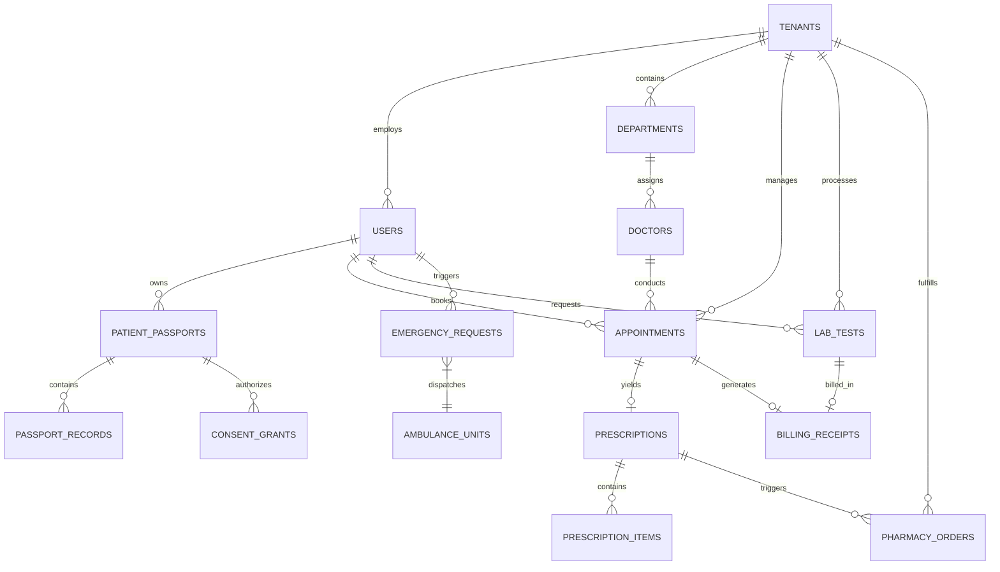

# healthcare+ (PERN Stack Rebuild) — Production Architecture & Implementation Plan

> **Executive Summary**: This document serves as the master architectural specification and technical blueprint for rebuilding **healthcare+** from a single-hospital Django/SQLite prototype into an enterprise-grade, multi-tenant **Healthcare Operating System (SaaS Network)** using the **PERN Stack** (PostgreSQL, Express.js, React, Node.js). 

---

## 1. Existing Codebase Audit

### 1.1 Architecture & Tech Stack Overview
- **Frontend**: Single-page React application built with Vite (`frontend/src/App.jsx`). Monolithic structure containing inline component definitions, CSS-in-JS design tokens, mock state presets, and manual fetch wrappers (`frontend/src/api.js`).
- **Backend**: Django 5.x REST Framework (`backend/api`) with monolithic `views.py` containing `ViewSet` classes for all entities (`AuthViewSet`, `UserViewSet`, `AppointmentViewSet`, `PrescriptionViewSet`, `LabTestViewSet`, `BillingViewSet`, `EmergencyRequestViewSet`, `PharmacyOrderViewSet`, `PatientQueryViewSet`, `AnalyticsViewSet`).
- **Database**: Single SQLite database (`db.sqlite3`).
- **State & Data Flow**: React local state seeded with static initial arrays in `App.jsx`, synchronized asynchronously via REST API calls.

### 1.2 Identified Business Modules & Capabilities
1. **Authentication & Roles**: Basic login/registration supporting 6 roles (`patient`, `doctor`, `lab`, `admin`, `hospital`, `pharmacy`). Unhashed passwords (demo setup).
2. **Patient Query & AI Triage**: Basic symptom submission mapped through `SYMPTOM_TO_DEPT` constant and `AIRecommendationEngine` string matching rules.
3. **Appointment & Queue Management**: Sequential queue number generation per doctor/date. Status state machine (`PENDING` -> `CONFIRMED` -> `IN_PROGRESS` -> `COMPLETED`).
4. **Clinical Decision Support (CDS)**: Hardcoded rule engine (`CDSWarningEngine`) evaluating pediatric contraindications, dosage thresholds, and radiation/fasting checks.
5. **Prescriptions & Pharmacy**: Doctor prescription entry, dose countdown decrementer, pharmacy order placement, pickup flags, and reminder toggles.
6. **Lab Workflow**: Test request creation, pricing catalog updates, PDF report upload (`MultiPartParser`), and status transitions.
7. **Billing & Receipts**: Automated bill creation upon appointment booking with receipt ID (`HP-APT-XXXX`), consultation/lab/pharmacy itemization, and verification badge.
8. **Emergency System**: 3-second hold trigger button, GPS location string capture, and First-Come-First-Served (FCFS) hospital acceptance with ETA response.
9. **Notifications**: In-app DB notification dispatching across appointment, lab, billing, medicine, queue, and query events.

---

## 2. Gap Analysis & Technical Debt

| Architectural Dimension | Existing System (Django / SQLite Monolith) | Proposed PERN SaaS Platform |
| :--- | :--- | :--- |
| **Multi-Tenancy** | Single hospital single-tenant model. No tenant isolation. | Native multi-tenancy with `tenant_id` scoping, tenant-isolated data, and Platform Super Admin controls. |
| **Database Engine** | SQLite (concurrency bottlenecks, lacks RLS, lacks GIS for spatial queries). | PostgreSQL 16+ with PostGIS (ambulance spatial queries), JSONB support, Connection Pooling (PgBouncer), and Row-Level Security (RLS). |
| **Real-Time Communication**| Polling / manually refreshed state. | Socket.io with Redis Pub/Sub for live queue updates, real-time ambulance tracking, and notification delivery. |
| **Medical Identity** | Local patient accounts bound to one DB instance. | Unified **Healthcare Passport** providing encrypted patient health timeline across all participating network hospitals. |
| **Ambulance Engine** | Static string location and simple acceptance endpoint. | Geofenced Uber/Rapido-style driver dispatch engine with live GPS streaming, pre-arrival hospital alerts, and failover. |
| **AI Capabilities** | Hardcoded keyword mapping rules (`if "fever" in symptoms`). | LLM-powered Triage Agent (OpenAI/Gemini integration), dynamic wait time prediction models, and intelligent CDS alerts. |
| **Security & Auth** | Plaintext passwords, mock JWTs, no rate limiting, missing CORS headers. | Argon2id password hashing, RS256 JWT access/refresh token rotation, Redis token blacklisting, RBAC matrix, and OWASP defense. |
| **Code Modularization** | 3,000-line monolithic `App.jsx` and 480-line `views.py`. | Clean Modular Layered Architecture (Controller -> Service -> Repository) in Express and Feature-based Component Layout in React. |

---

## 3. New Product Vision: Transparent Healthcare Operating System

**healthcare+** is a multi-hospital SaaS network platform. Hospitals subscribe to host their digital workflows (queues, EHR, billing, labs, pharmacy, emergency response), while patients utilize a single unified mobile/web application.

```
+-----------------------------------------------------------------------------------+
|                                  healthcare+                                      |
|                       Multi-Hospital Healthcare Network                           |
+-----------------------------------------------------------------------------------+
                                         |
     +-----------------------------------+-----------------------------------+
     |                                                                       |
+----+----------------------------------+       +----------------------------+----+
|        Central Healthcare Passport    |       |       Hospital Tenant A        |
|  - Universal Medical History          |       | - Isolated Operational Data    |
|  - Cross-Hospital Consent Matrix      |       | - Custom Queue & Doctors       |
|  - Immunizations & Chronic Conditions |       | - Hospital Labs & Pharmacy     |
+---------------------------------------+       +---------------------------------+
                                         |
                                                +----------------------------+----+
                                                |       Hospital Tenant B        |
                                                | - Isolated Operational Data    |
                                                | - Custom Queue & Doctors       |
                                                | - Hospital Labs & Pharmacy     |
                                                +---------------------------------+
```

---

## 4. Functional Requirements

### 4.1 Tenant & Hospital Management
- Hospital onboarding, custom branding, working hours, department configuration, and staff management.
- Complete operational data isolation between hospitals.

### 4.2 Healthcare Passport
- Universal patient identifier (UUID-v4) holding lifelong medical records.
- Patient-controlled granular access grant/revoke system for attending doctors.

### 4.3 AI Symptom Triage & Hospital Discovery
- Natural language symptom input evaluated by AI Triage Engine to recommend appropriate departments.
- Geo-location discovery displaying nearby hospitals sorted by distance, queue load, wait time, and doctor availability.

### 4.4 Live Queue & Appointment Management
- Pre-payment enforced booking flow generating token numbers.
- Live token position tracking, doctor consultation pace estimation, and queue delay alerts via WebSockets.

### 4.5 Emergency Ambulance Dispatch (Uber-style)
- Emergency trigger detecting high-accuracy GPS coordinates.
- Dynamic broadcast to nearby active ambulance drivers; driver acceptance locks dispatch.
- Real-time GPS coordinate streaming to patient app and destination hospital ER dashboard.

### 4.6 Lab, Pharmacy, & Billing Workflows
- Integrated lab ordering with forced payment prior to sample collection. PDF report generation and storage.
- e-Prescriptions triggering automated pharmacy fulfillment orders and scheduled push medicine reminders.
- Itemized multi-charge transparent billing receipts with digital cryptographic verification badges.

---

## 5. Non-Functional Requirements

- **Performance**: Sub-100ms API response time (p95); real-time WebSocket latency < 50ms.
- **Scalability**: Capable of handling 5,000 concurrent hospital tenants and 100,000 active patient sessions.
- **Availability**: 99.95% uptime SLA with active-passive database failover and Redis sentinel replication.
- **Security & Compliance**: HIPAA and GDPR aligned data privacy architecture, AES-256 field encryption for PII, TLS 1.3 in transit.
- **Observability**: Structured JSON logs (Pino), Prometheus metrics, OpenTelemetry distributed tracing.

---

## 6. Complete User Flows

### 6.1 Patient Triage to Appointment & Queue Flow

```
[ Patient App ] ---> Enters Symptoms ("Fever & Severe Headache")
        |
        v
[ AI Triage Engine ] ---> Recommends "Neurology / General Physician"
        |
        v
[ Hospital Explorer ] ---> Selects Hospital (Sorted by Distance & Wait Time)
        |
        v
[ Select Doctor & Slot ] ---> Chooses Dr. Mehta @ 10:30 AM
        |
        v
[ Payment Gateway ] ---> Pays Consultation Fee (₹500)
        |
        v
[ Queue Engine ] ---> Generates Token #14 | Est. Time: 10:45 AM
        |
        v
[ Live WebSocket Stream ] ---> Real-time Position Updates (Ahead: 3 Patients)
```

### 6.2 Emergency Ambulance Dispatch Flow

```
[ Patient Emergency Hold (3s) ] ---> High Precision GPS Acquired
        |
        v
[ Emergency Broadcast Engine ] ---> Searches 10km Radius for Active Ambulance Drivers
        |
        +---> [ Driver Accepts ] ---> Locks Driver & Calculates Route
        |                                    |
        |                                    +---> Pre-Alert Sent to Hospital ER Team
        |                                    +---> Real-Time GPS Tracking Enabled
        |
        +---> [ Driver Timeout (15s) ] ---> Auto-escalates to 108/102 Dispatch System
```

---

## 7. Wireframes (ASCII / Markdown Layouts)

### 7.1 Patient Healthcare+ Dashboard & Hospital Discovery

```
+-----------------------------------------------------------------------------------+
|  healthcare+  |  Passport ID: HP-9082-331  |  [ Nearby ] [ History ]  (🔔 3) (👤)  |
+-----------------------------------------------------------------------------------+
|                                                                                   |
|  🤖 AI Symptom Assistant                                                          |
|  +-----------------------------------------------------------------------------+  |
|  |  "How are you feeling today?"                                               |  |
|  |  [ E.g., I have severe knee pain while walking since 3 days               ] |  |
|  |  < Analyze & Suggest Department >                                           |  |
|  +-----------------------------------------------------------------------------+  |
|                                                                                   |
|  🏥 Nearby Subscribed Hospitals (Within 10 km)                                    |
|  +-----------------------------------------------------------------------------+  |
|  | City General Hospital (1.2 km)  ⭐ 4.8  | Queue Load: MODERATE  | Wait: 15m   |  |
|  | Depts: Cardiology, Neurology, Orthopedics, General                          |  |
|  | < View Available Doctors & Book >                                           |  |
|  +-----------------------------------------------------------------------------+  |
|  | Apollo Care Center (3.5 km)      ⭐ 4.6  | Queue Load: LOW       | Wait: 5m    |  |
|  | Depts: General, Pediatrics, Dermatology                                     |  |
|  | < View Available Doctors & Book >                                           |  |
|  +-----------------------------------------------------------------------------+  |
+-----------------------------------------------------------------------------------+
```

### 7.2 Doctor Dashboard & Patient Timeline View

```
+-----------------------------------------------------------------------------------+
| Dr. Priya Mehta (General Medicine) | City General Hospital        (Queue Token: #08)|
+-----------------------------------------------------------------------------------+
| CURRENT PATIENT: Rohan Patel (Male, 34) | Passport: HP-7721-009                    |
+----------------------------------+------------------------------------------------+
|  Medical Passport & History      |  Active Consultation                           |
|  - Allergies: Penicillin         |  --------------------------------------------  |
|  - Chronic: Stage 1 Hypertension |  Diagnosis:                                    |
|  - Past Visits:                  |  [ Acute Viral Fever                         ] |
|    * 2026-01-12: Lipid Profile   |  --------------------------------------------  |
|    * 2025-11-05: ECG Normal      |  Prescribe Medicines:                          |
|                                  |  + Paracetamol 650mg | 1-0-1 | 5 Days           |
|                                  |  + Pantoprazole 40mg | 1-0-0 | 5 Days           |
|  [ Request Lab Test ]            |  --------------------------------------------  |
|  [ View Imaging ]                |  < Save Prescription & Call Next Token >       |
+----------------------------------+------------------------------------------------+
```

---

## 8. Information Architecture

```
healthcare+ Platform
├── Public Portal
│   ├── Landing Page & Features
│   ├── Hospital Directory & Search
│   ├── Emergency SOS Trigger
│   └── Auth (Login / Register / SSO)
├── Patient Healthcare Passport System
│   ├── Unified Medical Timeline
│   ├── Hospital Explorer & AI Triage
│   ├── Appointment Booking & Live Queue
│   ├── e-Prescriptions & Medicine Reminders
│   ├── Lab Reports & Diagnostics
│   ├── Transparent Digital Billing & Receipts
│   └── Emergency Ambulance Live Tracker
├── Multi-Tenant Hospital Workspace
│   ├── Hospital Administration (Branding, Pricing, Staff, Depts)
│   ├── Doctor Desk (Queue Management, EHR, Prescription Generator, CDS Alerts)
│   ├── Lab Diagnostics Desk (Order Queue, Pricing Lock, PDF Uploader)
│   ├── Pharmacy Fulfillment Desk (Order Dispensing, Stock Tracking)
│   ├── Reception / Triage Desk (Walk-in Token Assignment)
│   └── ER Emergency Console (Ambulance Tracking, Pre-arrival Vitals)
├── Fleet Management Portal (Ambulance Drivers)
│   ├── Dispatch Requests & Navigation
│   └── Pre-Hospital Vitals Entry
└── Platform Super Admin Console
    ├── Tenant Onboarding & Subscriptions
    ├── Fraud Detection & System Audit Logs
    ├── Network Analytics & Capacity Monitoring
    └── AI Triage Rules & CDS Knowledge Base
```

---

## 9. Database Design Strategy

The database uses **PostgreSQL 16** with the **PostGIS extension**. Multi-tenancy is enforced via a hybrid approach: logical isolation using `tenant_id` on all operational tables with PostgreSQL **Row-Level Security (RLS)** policies ensuring strict data isolation per hospital, while global patient data resides in shared Passport tables accessible only via explicit authorization tokens.

---

## 10. Entity-Relationship (ER) Diagram



---

## 11. PostgreSQL Schema (DDL)

```sql
-- Enable PostGIS and UUID Extensions
CREATE EXTENSION IF NOT EXISTS "uuid-ossp";
CREATE EXTENSION IF NOT EXISTS "postgis";

-- 1. TENANTS TABLE (Multi-Hospital Isolation)
CREATE TABLE tenants (
    id UUID PRIMARY KEY DEFAULT uuid_generate_v4(),
    name VARCHAR(255) NOT NULL,
    code VARCHAR(50) UNIQUE NOT NULL,
    address TEXT NOT NULL,
    location GEOMETRY(Point, 4326),
    contact_email VARCHAR(255) NOT NULL,
    contact_phone VARCHAR(50) NOT NULL,
    is_active BOOLEAN DEFAULT TRUE,
    created_at TIMESTAMPTZ DEFAULT CURRENT_TIMESTAMP
);

CREATE INDEX idx_tenants_location ON tenants USING GIST(location);

-- 2. USERS & ROLES TABLE
CREATE TYPE user_role AS ENUM (
    'super_admin', 'hospital_admin', 'doctor', 'receptionist',
    'lab_tech', 'pharmacist', 'nurse', 'patient', 'ambulance_driver', 'support'
);

CREATE TABLE users (
    id UUID PRIMARY KEY DEFAULT uuid_generate_v4(),
    tenant_id UUID REFERENCES tenants(id) ON DELETE SET NULL, -- NULL for Global Patients/SuperAdmins
    email VARCHAR(255) UNIQUE NOT NULL,
    password_hash VARCHAR(255) NOT NULL,
    full_name VARCHAR(255) NOT NULL,
    phone VARCHAR(50),
    role user_role NOT NULL,
    is_verified BOOLEAN DEFAULT FALSE,
    created_at TIMESTAMPTZ DEFAULT CURRENT_TIMESTAMP
);

CREATE INDEX idx_users_tenant_role ON users(tenant_id, role);

-- 3. HEALTHCARE PASSPORTS (Patient Universal Record)
CREATE TABLE patient_passports (
    id UUID PRIMARY KEY DEFAULT uuid_generate_v4(),
    patient_id UUID UNIQUE NOT NULL REFERENCES users(id) ON DELETE CASCADE,
    blood_group VARCHAR(10),
    allergies JSONB DEFAULT '[]'::jsonb,
    chronic_conditions JSONB DEFAULT '[]'::jsonb,
    emergency_contact JSONB NOT NULL,
    created_at TIMESTAMPTZ DEFAULT CURRENT_TIMESTAMP,
    updated_at TIMESTAMPTZ DEFAULT CURRENT_TIMESTAMP
);

-- 4. APPOINTMENTS & QUEUE TABLE
CREATE TYPE appointment_status AS ENUM (
    'PENDING_PAYMENT', 'CONFIRMED', 'IN_PROGRESS', 'COMPLETED', 'CANCELLED'
);

CREATE TABLE appointments (
    id UUID PRIMARY KEY DEFAULT uuid_generate_v4(),
    tenant_id UUID NOT NULL REFERENCES tenants(id) ON DELETE CASCADE,
    patient_id UUID NOT NULL REFERENCES users(id),
    doctor_id UUID NOT NULL REFERENCES users(id),
    appointment_date DATE NOT NULL,
    slot_time TIME NOT NULL,
    token_number INT NOT NULL,
    status appointment_status DEFAULT 'PENDING_PAYMENT',
    consultation_fee NUMERIC(10,2) NOT NULL,
    created_at TIMESTAMPTZ DEFAULT CURRENT_TIMESTAMP,
    UNIQUE(tenant_id, doctor_id, appointment_date, token_number)
);

CREATE INDEX idx_appointments_queue ON appointments(tenant_id, doctor_id, appointment_date, status);

-- 5. BILLING & RECEIPTS TABLE (Transparent Ledger)
CREATE TABLE billing_receipts (
    id UUID PRIMARY KEY DEFAULT uuid_generate_v4(),
    tenant_id UUID NOT NULL REFERENCES tenants(id),
    patient_id UUID NOT NULL REFERENCES users(id),
    receipt_number VARCHAR(100) UNIQUE NOT NULL,
    consultation_fee NUMERIC(10,2) DEFAULT 0.00,
    lab_fee NUMERIC(10,2) DEFAULT 0.00,
    pharmacy_fee NUMERIC(10,2) DEFAULT 0.00,
    tax_amount NUMERIC(10,2) DEFAULT 0.00,
    discount_amount NUMERIC(10,2) DEFAULT 0.00,
    total_amount NUMERIC(10,2) NOT NULL,
    is_paid BOOLEAN DEFAULT FALSE,
    payment_method VARCHAR(50),
    transaction_ref VARCHAR(255),
    digital_signature TEXT NOT NULL, -- Cryptographic Receipt Verification
    created_at TIMESTAMPTZ DEFAULT CURRENT_TIMESTAMP
);

-- 6. EMERGENCY AMBULANCE DISPATCH TABLE
CREATE TYPE emergency_status AS ENUM (
    'BROADCASTING', 'ACCEPTED', 'EN_ROUTE_PATIENT', 'PATIENT_PICKED', 'ARRIVED_HOSPITAL', 'CANCELLED'
);

CREATE TABLE emergency_dispatches (
    id UUID PRIMARY KEY DEFAULT uuid_generate_v4(),
    patient_id UUID NOT NULL REFERENCES users(id),
    assigned_tenant_id UUID REFERENCES tenants(id),
    assigned_driver_id UUID REFERENCES users(id),
    patient_location GEOMETRY(Point, 4326) NOT NULL,
    status emergency_status DEFAULT 'BROADCASTING',
    eta_minutes INT,
    created_at TIMESTAMPTZ DEFAULT CURRENT_TIMESTAMP,
    updated_at TIMESTAMPTZ DEFAULT CURRENT_TIMESTAMP
);

CREATE INDEX idx_emergency_location ON emergency_dispatches USING GIST(patient_location);

-- ROW LEVEL SECURITY (RLS) POLICIES
ALTER TABLE appointments ENABLE ROW LEVEL SECURITY;

CREATE POLICY tenant_isolation_appointments ON appointments
    FOR ALL
    USING (tenant_id = NULLIF(current_setting('app.current_tenant_id', true), '')::uuid);
```

---

## 12. Backend Architecture (Express.js / Node.js)

The backend follows a **Clean Modular Layered Architecture** with strict boundary separation.

```
+-------------------------------------------------------------------+
|                        HTTP / WebSocket Layer                     |
|            Express Routes, Socket.io Handlers, Middleware         |
+-------------------------------------------------------------------+
                                  |
                                  v
+-------------------------------------------------------------------+
|                         Controller Layer                          |
|             Request Validation, Response Formatting               |
+-------------------------------------------------------------------+
                                  |
                                  v
+-------------------------------------------------------------------+
|                           Service Layer                           |
|       Core Business Logic, AI Engine Calls, Queue Computation      |
+-------------------------------------------------------------------+
                                  |
                                  v
+-------------------------------------------------------------------+
|                         Repository Layer                          |
|           SQL Queries, Data Access Objects, Transactions           |
+-------------------------------------------------------------------+
                                  |
                                  v
+-------------------------------------------------------------------+
|                    Database & Cache Services                      |
|                PostgreSQL Pool, Redis Cache & Pub/Sub             |
+-------------------------------------------------------------------+
```

---

## 13. Frontend Architecture (React.js + Vite)

Built with modern React practices using **Zustand** for lightweight state management, **TanStack Query (React Query)** for async server state, and **TailwindCSS / Vanilla CSS Modules** for styling.

```
Frontend State Tree
├── Auth Store (Zustand: user, token, activeTenant)
├── Live Queue Store (Zustand + Socket.io listener state)
├── Emergency Tracking Store (Zustand: driver GPS, ETA)
└── Server Cache (React Query: appointments, lab reports, passport timeline)
```

---

## 14. Detailed Folder Structures

### 14.1 Backend Folder Tree (`/backend`)

```
backend/
├── src/
│   ├── config/
│   │   ├── database.js          # PostgreSQL Pool & Knex/Prisma config
│   │   ├── redis.js             # Redis client & PubSub
│   │   └── environment.js       # Env variables validation (Zod)
│   ├── constants/               # Roles, status enums, error codes
│   ├── middleware/
│   │   ├── auth.middleware.js   # JWT verification & RBAC check
│   │   ├── tenant.middleware.js # Tenant extraction & RLS setup
│   │   ├── error.middleware.js  # Centralized error handling
│   │   └── rateLimiter.js       # Express rate limiter
│   ├── modules/
│   │   ├── auth/                # Auth routes, controller, service
│   │   ├── tenant/              # Multi-tenant management
│   │   ├── passport/            # Healthcare Passport logic
│   │   ├── queue/               # Live token engine
│   │   ├── emergency/           # Ambulance dispatch & socket
│   │   ├── triage/              # AI Triage & CDS engine
│   │   ├── lab/                 # Lab orders & file upload
│   │   ├── pharmacy/            # Orders & medicine reminders
│   │   └── billing/             # Billing & signature generation
│   ├── services/
│   │   ├── socket.service.js    # WebSocket event manager
│   │   ├── ai.service.js        # Gemini/OpenAI API client
│   │   ├── notification.service.js # BullMQ SMS/Email queue
│   │   └── storage.service.js   # S3/Local PDF storage
│   ├── utils/                   # Logger (Pino), encryption helpers
│   └── app.js                   # Express app entry point
├── Dockerfile
└── package.json
```

### 14.2 Frontend Folder Tree (`/frontend`)

```
frontend/
├── src/
│   ├── assets/                  # Fonts, icons, static images
│   ├── components/
│   │   ├── ui/                  # Buttons, Cards, Inputs, Modals, Badges
│   │   ├── layout/              # Sidebar, Header, PageContainer
│   │   ├── passport/            # Medical Timeline, Allergy Badges
│   │   ├── queue/               # Live Token Ticket, Delay Predictor
│   │   └── emergency/           # Uber-style Map Tracker
│   ├── context/                 # Socket Context Provider
│   ├── hooks/                   # useQueueSocket, useGeoLocation, useAuth
│   ├── pages/
│   │   ├── Landing/
│   │   ├── PatientDashboard/
│   │   ├── HospitalExplorer/
│   │   ├── DoctorConsole/
│   │   ├── LabConsole/
│   │   ├── PharmacyConsole/
│   │   ├── EmergencySOS/
│   │   └── AdminDashboard/
│   ├── services/                # Axios API instance & endpoints
│   ├── store/                   # Zustand stores (useAuthStore, useQueueStore)
│   ├── styles/                  # Theme tokens & global CSS
│   ├── App.jsx                  # Main router setup
│   └── main.jsx
├── index.html
├── vite.config.js
└── package.json
```

---

## 15. API Specifications

### Key API Endpoints

| HTTP Method | Endpoint | Auth Level | Description |
| :--- | :--- | :--- | :--- |
| `POST` | `/api/v1/auth/register` | Public | User registration (Patient/Staff) |
| `POST` | `/api/v1/auth/login` | Public | Authenticates user, returns JWT tokens |
| `GET` | `/api/v1/hospitals/search` | Authenticated | Discovers hospitals sorted by distance & queue |
| `POST` | `/api/v1/triage/analyze` | Authenticated | Accepts symptoms, returns recommended dept via AI |
| `POST` | `/api/v1/appointments/book` | Patient | Enforces payment & assigns queue token |
| `GET` | `/api/v1/queue/live/:doctorId` | Authenticated | Fetches live queue token position & delay |
| `POST` | `/api/v1/emergency/trigger` | Patient | Initiates ambulance dispatch broadcast |
| `POST` | `/api/v1/emergency/accept/:id` | Driver | Ambulance driver accepts emergency request |
| `GET` | `/api/v1/passport/timeline` | Auth / Consent | Retrieves patient universal medical history |
| `POST` | `/api/v1/lab/reports/upload` | Lab Tech | Uploads lab PDF & notifies patient/doctor |

---

## 16. Authentication & Security Flow

```
[ Client ] ---> POST /api/v1/auth/login { email, password }
   |
   v
[ Auth Controller ] ---> Verifies Argon2id Password Hash
   |
   v
[ Token Engine ] ---> Issues:
                        1. Access Token (JWT Short-Lived: 15 mins)
                        2. Refresh Token (Stored in HttpOnly, SameSite Cookie: 7 days)
   |
   v
[ Subsequent Requests ] ---> Header: Authorization: Bearer <AccessToken>
   |
   v
[ Auth Middleware ] ---> Decodes JWT, validates active session in Redis,
                        sets req.user and req.tenantId.
```

---

## 17. Authorization (RBAC Matrix)

| Role | Hospital Settings | Book Appointment | Manage Queue | View Passport | Prescribe | Lab Upload | Dispense Meds | Emergency Dispatch | System Analytics |
| :--- | :---: | :---: | :---: | :---: | :---: | :---: | :---: | :---: | :---: |
| **Super Admin** | ❌ | ❌ | ❌ | ❌ | ❌ | ❌ | ❌ | ❌ | ✅ |
| **Hospital Admin** | ✅ | ❌ | ❌ | ❌ | ❌ | ❌ | ❌ | ❌ | ✅ (Tenant) |
| **Doctor** | ❌ | ❌ | ✅ | ✅ (Granted) | ✅ | ❌ | ❌ | ❌ | ❌ |
| **Patient** | ❌ | ✅ | ✅ (Own) | ✅ (Own) | ❌ | ❌ | ❌ | ✅ | ❌ |
| **Lab Tech** | ❌ | ❌ | ❌ | ❌ | ❌ | ✅ | ❌ | ❌ | ❌ |
| **Pharmacist** | ❌ | ❌ | ❌ | ❌ | ❌ | ❌ | ✅ | ❌ | ❌ |
| **Ambulance Driver**| ❌ | ❌ | ❌ | ❌ | ❌ | ❌ | ❌ | ✅ | ❌ |

---

## 18. Notification Architecture

Using **BullMQ** backed by **Redis** for asynchronous multi-channel notification dispatch.

```
[ Application Event ] (e.g., Lab Report Completed)
         |
         v
[ Notification Publisher ] ---> Pushes job to BullMQ Queue
         |
         v
[ BullMQ Worker Process ]
         |
         +---> WebSockets  ---> Sent to online user's browser/app
         +---> Push Engine ---> FCM / APNS Push Notification
         +---> SMS Gateway ---> Twilio / MSG91 SMS fallback
         +---> Email Queue ---> SendGrid HTML Email
```

---

## 19. AI Integration & Safety Architecture

1. **AI Symptom Triage**:
   - Model: Gemini 1.5 Flash / GPT-4o-mini via structured JSON output prompt.
   - Purpose: Maps patient symptom description to medical specialties (e.g., Cardiology, Neurology).
   - **Safety Guardrail**: Appends mandatory disclaimer ("AI recommendation only. In case of emergency, press SOS button immediately.").
2. **AI Clinical Decision Support (CDS)**:
   - Evaluates prescriptions against patient age, allergies, and ongoing medications. Generates instant warning banners for doctors prior to final signature.
3. **AI Queue Wait-Time Predictor**:
   - Machine learning regression model evaluating doctor's historical average consultation time, current token pace, and emergency interruptions to predict arrival time.

---

## 20. Real-Time Architecture (WebSockets & Redis)

- **Engine**: Socket.io on Node.js cluster using `@socket.io/redis-adapter`.
- **Rooms Structure**:
  - `tenant:{hospitalId}`: Hospital-wide alerts.
  - `queue:{doctorId}:{date}`: Live token advancement updates.
  - `emergency:{dispatchId}`: Live GPS coordinate updates for patient and ER console.

---

## 21. Live Queue System Architecture

```
                 Doctor completes consultation
                                |
                                v
               POST /api/v1/queue/next-token
                                |
                                v
         Updates appointment status -> IN_PROGRESS
                                |
                                v
      [ Queue Service ] calculates updated ETA for remaining tokens
                                |
                                v
      [ Socket.io ] emits 'queue:updated' to room queue:{doctorId}
                                |
                                v
    All connected patient devices instantly animate token position counter
```

---

## 22. Emergency Dispatch System Architecture

1. **Trigger**: Patient presses & holds SOS for 3 seconds.
2. **Geolocation**: Browser/App HTML5 Geolocation API captures latitude/longitude.
3. **Spatial Query**: PostgreSQL PostGIS query locates available ambulances within 10km radius:
   ```sql
   SELECT id, driver_id, ST_Distance(current_location, ST_MakePoint($1, $2)::geography) AS distance_meters
   FROM ambulance_units
   WHERE is_available = TRUE AND ST_DWithin(current_location, ST_MakePoint($1, $2)::geography, 10000)
   ORDER BY distance_meters ASC;
   ```
4. **Broadcast & Lock**: Socket.io broadcasts to candidate drivers. First driver to accept locks the dispatch.
5. **Hospital Pre-Arrival Alert**: Destination hospital ER dashboard opens real-time tracking panel with live patient vitals feed.

---

## 23. Billing & Financial Transparency Architecture

- **Transparent Line Items**: Every charge (consultation, lab tests, medications, ambulance mileage, taxes) stored as individual immutable line items.
- **Digital Receipt Verification**: Each receipt generates a SHA-256 HMAC cryptographic signature incorporating `receipt_id`, `total_amount`, and `patient_id` signed by the platform secret key.
- **Verification Badge**: Anyone scanning the receipt QR code can verify authentic, un-tampered billing records.

---

## 24. Multi-Hospital SaaS Tenant Architecture

- **Isolation Strategy**: Shared Database, Separate Schemas / Tenant Keys with Row-Level Security (RLS).
- **Tenant Context Middleware**:
  ```javascript
  // Express Tenant Middleware
  export const enforceTenant = (req, res, next) => {
    const tenantId = req.headers['x-tenant-id'] || req.user?.tenantId;
    if (!tenantId && req.user?.role !== 'super_admin') {
      return res.status(403).json({ error: 'Tenant context missing' });
    }
    req.tenantId = tenantId;
    // Set PostgreSQL session variable for RLS
    db.raw(`SET LOCAL app.current_tenant_id = '${tenantId}'`);
    next();
  };
  ```

---

## 25. Healthcare Passport & Consent Management

- **Patient Ownership**: Patients hold absolute rights to their Healthcare Passport.
- **Granular Consent Grants**:
  - Emergency Override: Temporary access granted to attending ER doctors during active emergency dispatch.
  - Consultation Grant: Booking an appointment automatically grants 24-hour record read access to the treating doctor.
  - Manual Revocation: Patient can revoke access at any time via Passport settings.

---

## 26. Scalability Strategy

- **Stateless Backend**: Express app nodes are completely stateless, deployed across auto-scaling containers behind NGINX.
- **Database Connection Pooling**: PgBouncer managing database connections.
- **Read/Write Splitting**: Read queries (analytics, hospital searches) routed to PostgreSQL Read Replicas; writes go to Primary DB.
- **Caching Layer**: Redis caching hospital metadata, lab price catalogs, and user sessions.

---

## 27. Security & Compliance Plan

- **Encryption**: AES-256-GCM for sensitive health data at rest; TLS 1.3 for data in transit.
- **OWASP Mitigation**:
  - **Helmet.js** for HTTP security headers.
  - **Express-rate-limit** for API rate limiting.
  - **Zod / Joi** for strict request body schema validation (preventing injection attacks).
- **Audit Logs**: Immutable audit log table recording all access to medical records (`action`, `user_id`, `target_passport_id`, `timestamp`, `ip_address`).

---

## 28. Deployment Architecture

```
                                  [ Cloudflare DNS / WAF ]
                                             |
                                             v
                                  [ NGINX Reverse Proxy ]
                                             |
                  +--------------------------+--------------------------+
                  |                                                     |
                  v                                                     v
      [ Express Node Cluster ]                              [ React Frontend CDN ]
      (Managed by PM2 / Docker)                             (Static Build Assets)
                  |
        +---------+---------+
        |                   |
        v                   v
[ PostgreSQL 16 ]     [ Redis Cluster ]
(Primary + Replica)   (Cache + Pub/Sub + BullMQ)
```

---

## 29. Testing Strategy

- **Unit Testing**: Jest for backend services and utility functions.
- **Integration Testing**: Supertest testing Express route handlers against a test PostgreSQL database.
- **Frontend Testing**: React Testing Library for UI components and custom hooks.
- **End-to-End (E2E)**: Playwright simulating complete patient appointment booking and emergency SOS flows.

---

## 30. Monitoring & Observability

- **Application Metrics**: Prometheus metrics exported from Express via `prom-client`.
- **Log Aggregation**: Structured JSON logs written via **Pino** and aggregated using Grafana Loki.
- **Error Tracking**: Sentry SDK integration for real-time frontend and backend exception monitoring.

---

## 31. Production Readiness Checklist

- [ ] All PostgreSQL database tables created with foreign keys, indexes, and RLS policies.
- [ ] Redis instance configured with eviction policies and persistence.
- [ ] JWT secrets and database credentials stored securely in environment variables / Secrets Manager.
- [ ] Rate limiting enabled on authentication and emergency endpoints.
- [ ] CORS policies locked down to trusted domain names.
- [ ] SSL/TLS certificates configured with automatic renewal.
- [ ] Automated database backup cron jobs verified (hourly WAL archiving, daily full dump).

---

## 32. Development Roadmap

```
Phase 1: Architecture & Core Foundations (Weeks 1-2)
Phase 2: Authentication & Healthcare Passport (Weeks 3-4)
Phase 3: Multi-Hospital & Doctor Console (Weeks 5-6)
Phase 4: AI Triage & Live Queue Engine (Weeks 7-8)
Phase 5: Real-Time Emergency SOS & Ambulance System (Weeks 9-10)
Phase 6: Lab, Pharmacy & Billing Integration (Weeks 11-12)
Phase 7: Security Audit, Testing & Production Deployment (Weeks 13-14)
```

---

## 33. Phase-wise Milestones

- **Milestone 1**: Database DDL deployed, multi-tenant middleware verified, JWT auth functional.
- **Milestone 2**: Healthcare Passport timeline working with cross-hospital consent grants.
- **Milestone 3**: AI Triage responding, pre-paid appointment booking assigning live tokens.
- **Milestone 4**: WebSockets broadcasting live queue updates; emergency SOS dispatching simulated drivers on PostGIS map.
- **Milestone 5**: Full end-to-end integration verified; load testing passing 2,000 req/sec; production deployment complete.

---

## 34. Task Breakdown for Every Phase

### Phase 1: Foundations
- Task 1.1: Setup Node.js + Express TypeScript/ESM repository structure.
- Task 1.2: Configure PostgreSQL database connection pool and run initial DDL migration.
- Task 1.3: Implement Pino logger and centralized error handling middleware.

### Phase 2: Auth & Passport
- Task 2.1: Implement Argon2id password hashing and JWT token management.
- Task 2.2: Build Patient Healthcare Passport schema and CRUD APIs.
- Task 2.3: Create consent grant verification middleware for doctor access.

### Phase 3: Hospital & Queue Engine
- Task 3.1: Build hospital tenant onboarding and department setup APIs.
- Task 3.2: Create atomic token generator service in PostgreSQL/Redis.
- Task 3.3: Implement Socket.io server and queue advancement events.

### Phase 4: AI & Emergency
- Task 4.1: Integrate Gemini API client for AI Symptom Triage.
- Task 4.2: Build PostGIS spatial ambulance search endpoint.
- Task 4.3: Implement real-time GPS tracking WebSocket room for emergency dispatches.

---

## 35. Risks & Mitigation

| Risk Event | Severity | Impact | Mitigation Strategy |
| :--- | :---: | :---: | :--- |
| Database multi-tenant data bleed | High | Critical | Enforce PostgreSQL Row-Level Security (RLS) policies at DB driver layer; automated integration tests checking cross-tenant query rejections. |
| Emergency GPS tracking signal drop | High | High | Implement local device dead-reckoning fallback and immediate auto-escalation to 108/102 tele-dispatch after 15-second driver response timeout. |
| AI Triage hallucination / misdiagnosis | Medium | High | Restrict AI prompt output strictly to department matching; display mandatory disclaimers and immediate SOS call button on all triage screens. |

---

## 36. Future Enhancements

1. **Telemedicine Video Consultations**: Integrated WebRTC peer-to-peer video rooms for remote appointments.
2. **IoT Vitals Streaming**: Bluetooth LE integration with smart watch/pulse oximeter devices streaming live vitals directly into the Healthcare Passport.
3. **ABDM / FHIR Compliance**: Native support for Health Level Seven (HL7) FHIR standards and India ABDM Health ID integration for national interoperability.
